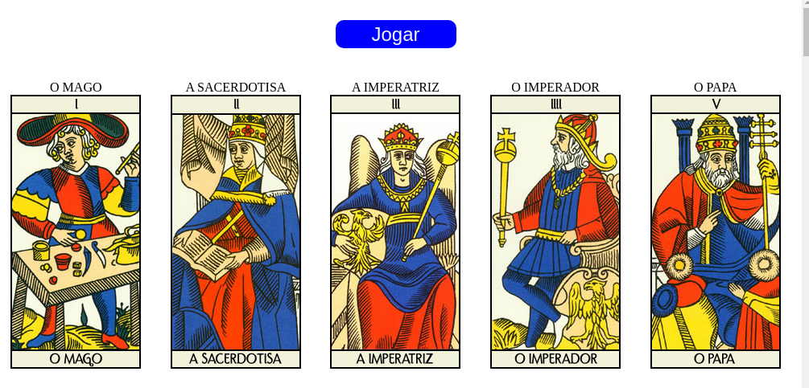
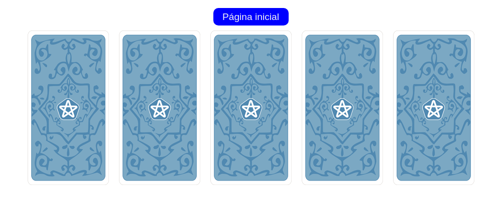
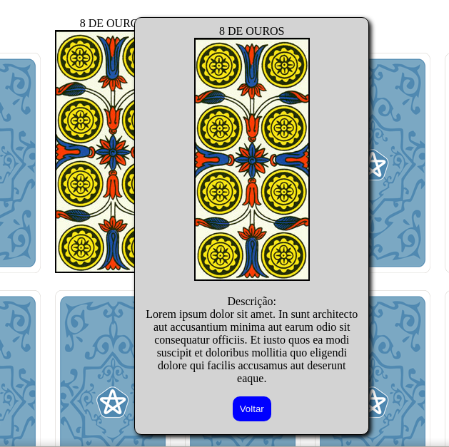

<!DOCTYPE html>
<html>
<head>
	<meta charset="utf-8">
	<title></title>
</head>
<body>
	<h1>Front-end-challenge</h1>
	
Projeto desafio front-end, cujo objetivo é a criação de um jogo de tarot, com seleção e embaralhamento de cartas. Segue o passo a passo da implementação.
	

		<ul>
			<li>Página incial:</li>
			
			
Aqui é onde tudo começa, com todas as cartas e seus conteudos expostos. Clicando no botão jogar você é redirecionado para uma página onde todas elas estão viradas e seus nomes e conteudos não estão visíveis.

			<li>Cartas viradas:</li>
			
			
Está é página onde você seleciona uma carta e um popup é aberto com o nome e a descrição da carta. Nesta página a ordem do baralho já não é a mesma da página inicial, onde era possível saber a posição de cada carta especificamente. Nesta página elas estão embaralhadas

			<li>Popup de descrição:</li>
			
		</ul>
	

	

</body>
</html>